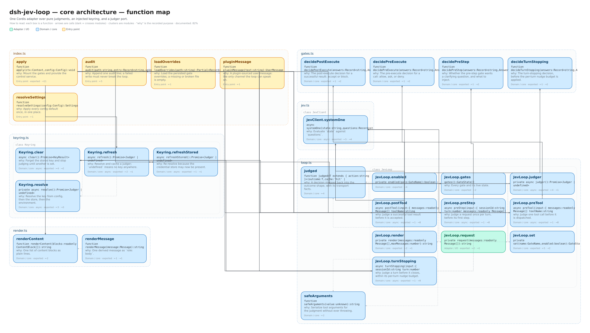

# Architecture

Two packages, one workspace. The boundary between them is the whole point: the
feature is usable from a plain DeepSeek Harness with no UI at all, and moqi adds
only a panel.

| Package | For | Depends on |
|---|---|---|
| `packages/dsh-jev-loop` | any Harness composition | no host, no UI |
| `packages/moqi-jev-loop` | moqi | the core's `jevLoop` service and moqi's `tuiHost` |

## The core, as modules

Each row is a module with a small interface over a lot of behaviour. The map
below is the wiring; this table is the contract.

| Module | Interface | Hides |
|---|---|---|
| `gates.ts` | `decidePreStep` · `decidePreExecute` · `decidePostExecute` · `decideTurnStopping` | every threshold, mode, hazard order, and prompt word | 
| `keyring.ts` | `refresh` · `refreshStored` · `set` · `clear` · `status` · `live` | resolution order, lazy client creation, probing, the store |
| `loop.ts` | `JevLoop` — one method per gate, plus the control surface | state assembly, once-per-turn, nudge budgets, audit |
| `jev.ts` | `Judger.systemOne` | retry, backoff, cache, state cap |
| `render.ts` | `renderMessages` · `renderContent` · `lastUserRequest` | derived messages to Jev text |
| `index.ts` | the Cordis plugin (`apply`) | config, event wiring, effects |

The domain modules import no Cordis: `gates.ts` is pure, and `keyring.ts` /
`loop.ts` take their dependencies as ports. `index.ts` is the only file that
knows the Harness.



*Editable source: [`whiteboards/dsh-jev-loop-core.excalidraw`](whiteboards/dsh-jev-loop-core.excalidraw) · data: [`whiteboards/dsh-jev-loop-core.json`](whiteboards/dsh-jev-loop-core.json).*

## The adapter, as a module

The adapter turns the core's `jevLoop` service into rows and actions. It makes
no judgments and reads no messages.

| Module | Interface | Hides |
|---|---|---|
| `panel.ts` | `panelRows(service)` · `panelActivate(service, id)` | the row order, the on/off copy, the masked-secret request |
| `index.ts` | the Cordis plugin (`apply`) | the `tuiHost` seam and the two injected services |


*Editable source: [`whiteboards/moqi-jev-loop-adapter.excalidraw`](whiteboards/moqi-jev-loop-adapter.excalidraw) · data: [`whiteboards/moqi-jev-loop-adapter.json`](whiteboards/moqi-jev-loop-adapter.json).*

## Seams, and why each one exists

The design follows the dependency category of each thing the core touches:

- **TypeSafe is a true external service.** It sits behind the `Judger` port.
  Production injects `JevClient`; tests inject an in-memory judger. Two adapters
  means a real seam, not indirection.
- **The credential store is local-substitutable.** It sits behind the
  `CredentialStore` port. Production adapts `ctx.credentials`; tests pass a map.
  `index.ts#credentialStore` is the only line that mentions `ctx.credentials`.
- **The judgments are in-process.** They are pure functions over an answers
  map, so they need no seam at all.
- **moqi is a host.** Its `tuiHost.registerPanel` is the seam the adapter fills;
  the adapter injects both services, so it never applies without them.

The deletion test holds for the deepened modules: remove `JevLoop` and the
per-turn budget, nudge cap, audit, and state assembly reappear in four separate
event handlers.

## Tests

```bash
npm test   # gates, keyring, loop, panel — no Harness and no network
```

The tests drive the same interfaces production does: `gates.ts` with answer
maps, `Keyring` with an in-memory store, `JevLoop` with a counting judger, and
`panel.ts` with a fake service. They assert on returned outcomes, not internal
state, so they survive refactors inside each module.

## Regenerating the maps

The maps are made with [`exdraw`](https://github.com/) (Excalidraw code maps).
After a structural change:

```bash
exdraw map packages/dsh-jev-loop/src --focus apply --depth 2 \
  --annotations docs/whiteboards/dsh-jev-loop-core.annotations.yaml \
  --out docs/whiteboards/dsh-jev-loop-core

exdraw map packages/moqi-jev-loop/src \
  --annotations docs/whiteboards/moqi-jev-loop-adapter.annotations.yaml \
  --out docs/whiteboards/moqi-jev-loop-adapter
```

Each function's one-line *why* comes from its JSDoc. The `*.annotations.yaml`
files add the framing the doc comments cannot — titles and how the seams fit —
and are safe to edit; regenerating the maps never overwrites them.
