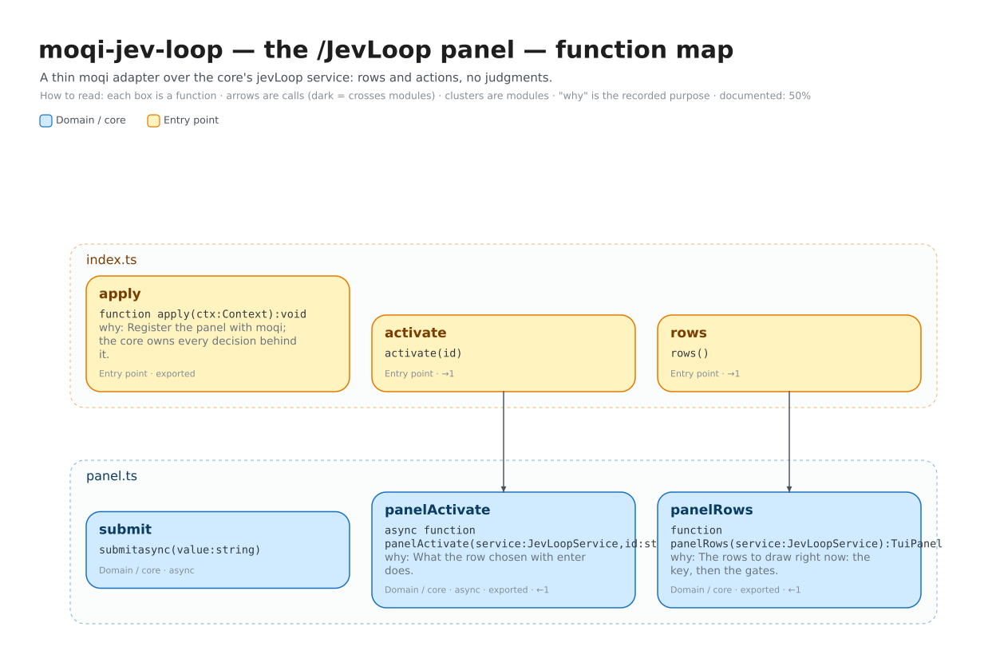

# Architecture

One package: the adapter that turns the core's `jevLoop` service into moqi's
`/JevLoop` panel. It makes no judgments and reads no messages. The feature
itself — and the four gates — live in the separate
[`dsh-jev-loop`](https://github.com/JWE24-code/dsh-jev-loop) repository, and the
boundary between the two repositories is the whole point: the core is usable
from a plain DeepSeek Harness with no UI at all, and this package adds only a
panel.

| Package | For | Depends on |
|---|---|---|
| [`dsh-jev-loop`](https://github.com/JWE24-code/dsh-jev-loop) | any Harness composition | no host, no UI |
| `moqi-jev-loop` (this repo) | moqi | the core's `jevLoop` service and moqi's `tuiHost` |

## The adapter, as a module

The adapter turns the core's `jevLoop` service into rows and actions. It makes
no judgments and reads no messages.

| Module | Interface | Hides |
|---|---|---|
| `panel.ts` | `panelRows(service)` · `panelActivate(service, id)` | the row order, the on/off copy, the masked-secret request |
| `index.ts` | the Cordis plugin (`apply`) | the `tuiHost` seam and the two injected services |



*Editable source: [`whiteboards/moqi-jev-loop-adapter.excalidraw`](whiteboards/moqi-jev-loop-adapter.excalidraw) · data: [`whiteboards/moqi-jev-loop-adapter.json`](whiteboards/moqi-jev-loop-adapter.json).*

## Seams, and why each one exists

The design follows the dependency category of each thing the adapter touches:

- **moqi is a host.** Its `tuiHost.registerPanel` is the seam the adapter fills;
  the adapter injects both `jevLoop` and `tuiHost`, so it never applies without
  them.
- **The core is a service, not an import.** `dsh-jev-loop` provides `jevLoop`
  through the container; the adapter's TypeScript view of it is structural, so
  the two packages build and version independently.

The deletion test holds for the adapter: remove it and moqi has no `/JevLoop`
command, no gate rows, and no masked key prompt.

## Tests

```bash
npm test   # panel.ts with a fake service — no Harness and no network
```

The tests drive the same interface production does: `panel.ts` with a fake
service. They assert on returned rows and results, not internal state, so they
survive refactors inside the module.

## Regenerating the map

The map is made with [`exdraw`](https://github.com/) (Excalidraw code maps).
After a structural change:

```bash
exdraw map src \
  --annotations docs/whiteboards/moqi-jev-loop-adapter.annotations.yaml \
  --out docs/whiteboards/moqi-jev-loop-adapter
```

Each function's one-line *why* comes from its JSDoc. The `*.annotations.yaml`
file adds the framing the doc comments cannot — titles and how the seams fit —
and is safe to edit; regenerating the map never overwrites it.
